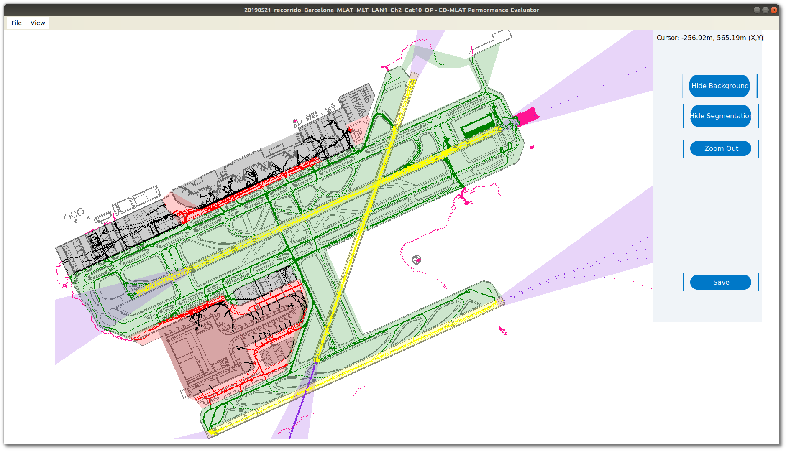

# MLAT_BCN
Welcome to ED-MLAT Performance Evaluator. This application calculates the value of the different parameters listed in the document of EUROCAE “MOPS for Mode S MLAT Systems” (ED-117) using .ast files of opportunity traffic from LEBL, and determines if the MLAT meets these minimum requirements. It also allows analyzing D-GPS recordings to calculate position accuracy data; and it provides an interface that allows you to\ndiscard certain vehicles from the analysis.

## Build instructions for Ubuntu

### Install dependencies using software packages:

This program has been developed with the Microsoft .NET Framework. In order to build the software on a GNU/Linux system, it is necessary to use Mono.

~~~
$ sudo apt install mono-complete nuget
~~~

### Clone the repository:

~~~
$ git clone https://github.com/KlingenbergMarc/MLAT_BCN.git
~~~

### Restore packages with NuGet:

This step installs the SpreadsheetLight and DocumentFormat.OpenXml packages required by the application.

~~~
$ cd MLAT_BCN
$ nuget restore -SolutionDirectory ./
~~~

### Build ED-MLAT Performance Evaluator:

~~~
$ msbuild ./ED-SMR_MLAT-Performance.sln
~~~

### Add required configuration files in the executable directory:

~~~
$ cp -a ./config/. ./ED-SMR_MLAT-Performance/bin/Debug/
~~~

### Run ED-MLAT Performance Evaluator:

~~~
$ mono ./ED-SMR_MLAT-Performance/bin/Debug/ED-SMR_MLAT-Performance.exe
~~~
